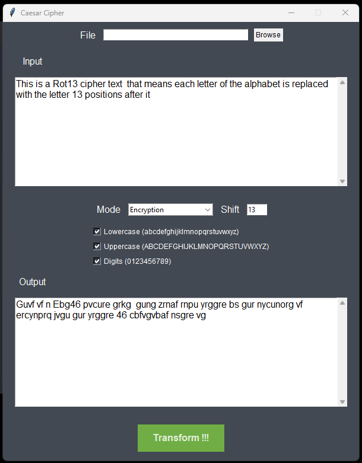

# Internship

## TASK 1 | PRODIGY_CS_01 (Caesar Cipher)

First **Install** Dependencies

```
pip install tk
```

```
cd /PRODIGY_CS_01 Caesar Cipher
python caesar_cipher.py
```

[Source Code](./PRODIGY_CS_01%20Caesar%20Cipher/caesar_cipher.py)

<div style="text-align:center;">

</div>

---

## TASK 2 | PRODIGY_CS_02 (Pixel Manipulation)

First **Install** Dependencies

```
pip install tk
pip install numpy
pip install opencv-python
pip install pillow
```

```
cd /PRODIGY_CS_01 Pixel Manipulation
python img_crypt_tool.py
```

[Source Code](./PRODIGY_CS_02%20Pixel%20Manipulation/img_crypt_tool.py)

<div style="text-align:center;">


</div>

---

## TASK 3 | PRODIGY_CS_03 (Password Complexity)

First **Install** Dependencies

```
pip install tk
```

```
cd /PRODIGY_CS_03 Password Complexity
python img_crypt_tool.py
```

[Source Code](./PRODIGY_CS_03%20Password%20Complexity/password_strength_meter.py)

<div style="text-align:center;">

</div>

---

## TASK 4 | PRODIGY_CS_04 (Keylogger)

```
cd /PRODIGY_CS_04 Keylogger
python img_crypt_tool.py
```

[Source Code](./PRODIGY_CS_04%20Keylogger/keylogger.py)

<div style="text-align:center;">

</div>

---

## TASK 5 | PRODIGY_CS_05 (Network Packet Analyzer)

First **Install** Dependencies

```
pip install scapy
```

For **Windows** systems install npcap [Download](https://npcap.com/#download)

For **Debian/Ubuntu-based** systems install libcap-dev

```
sudo apt-get update
sudo apt-get install libpcap-dev
```

```
cd /PRODIGY_CS_05 Network Packet Analyzer
python img_crypt_tool.py
```

[Source Code](./PRODIGY_CS_05%20Network%20Packet%20Analyzer/packet_analyzer.py)

<div style="text-align:center;">

</div>

---
